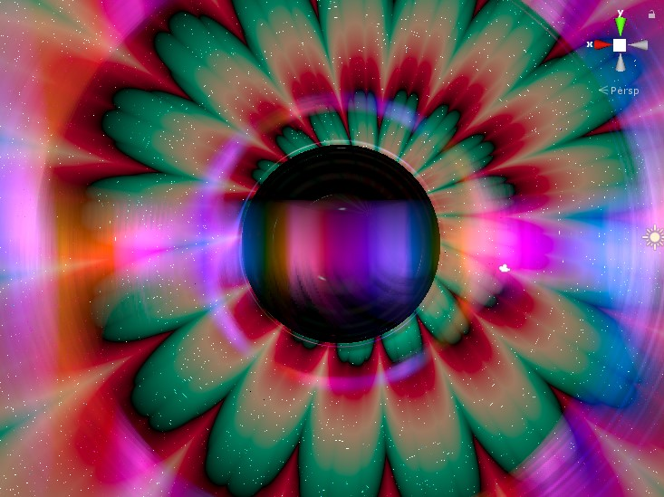

# SMBH Shader Unity
Supermassive black hole shader based upon Kelvin van Hoorn's SMBH tutorial for Unity.
https://kelvinvanhoorn.wordpress.com/2021/04/20/supermassive-black-hole-tutorial/

EDIT: 05/04/2026 - Added new shader that's a bit more suitable for anyone who wants to use it, no more SDFMaster.cginc, etc. I actually recommend using [Misha's black hole shader](https://gist.github.com/MichaelMoroz/b35d456056f3b958962ffb93f37ac55c) for the base though as it's more suitable for VR, more performant, and handles boundary conditions better. 